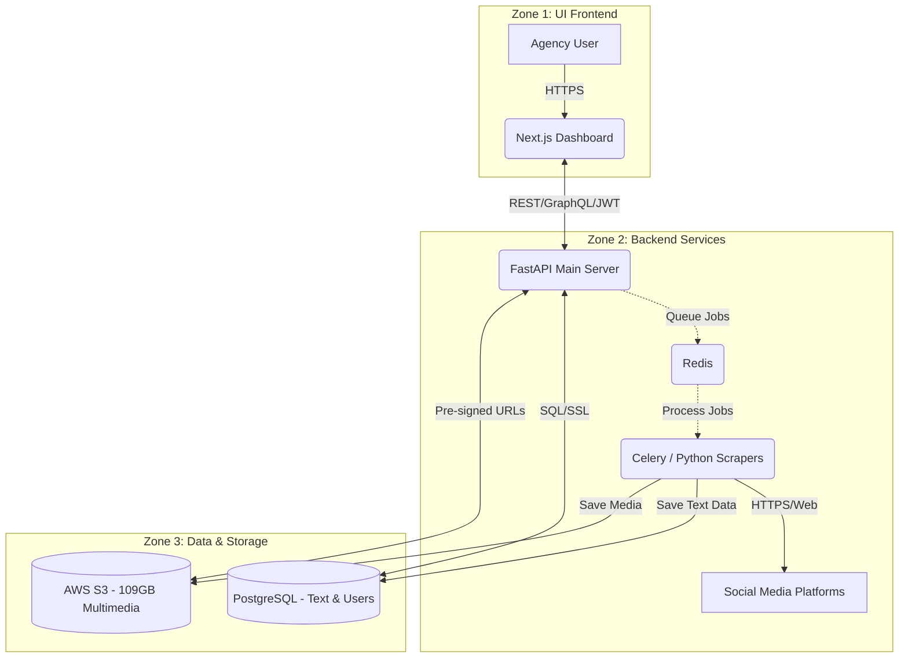

# Marketing Agency App - Development Roadmap & Architecture

## Project Overview
An internal application designed for a marketing agency managing a large volume of multimedia assets securely.
- **Max Users:** 20
- **Storage Need:** ~109 GB (primarily multimedia, plus text/metadata)
- **Key Features:** Close security/authentication, multimedia cloud storage, database for text data, social media scraping capabilities.

---

## Architecture Segmentation (3 Clear Zones)

### 1. UI (Frontend)
The user interface designed for agency staff to manage assets, view scraped data, and administer accounts.
- **Tech Stack:** React (Next.js) or Vue (Nuxt).
- **Features:** Dashboard, Secure Login/RBAC (Role-Based Access Control), Media Viewer, Scraping configuration portal.
- **Security:** JWT-based authentication, strict route guards.

### 2. Backend (API & Workers)
The backend is split into two distinct environments to ensure the application remains fast for users while handling heavy processing tasks in the background. 

- **Tech Stack:** Python (FastAPI). *Python is highly recommended due to its unmatched ecosystem for heavy web scraping and data processing.*

**A. Main API Service (The Intermediary & Traffic Cop)**
- **Purpose:** This is the primary interface for your frontend. It must remain fast and responsive at all times. It should never do heavy lifting (like scraping) directly.
- **Responsibilities:** 
  - Resolves API requests from the frontend (Dashboard queries, User Management).
  - Verifies user authentication and enforces Role-Based Access Control.
  - Generates secure, short-lived "pre-signed URLs" giving users temporary, direct access to view or upload 109GB+ multimedia stored in the cloud (so the API itself isn't bogged down transferring huge files).
  - Receives scraping instructions from the user and pushes them into a task queue for the workers to handle asynchronously.

**B. Worker Environment (The Heavy Lifters)**
- **Purpose:** A completely separate compute environment dedicated solely to background jobs that run over long periods. Separating this from the Main API guarantees the user experience never freezes when a 3-hour scraping task is running.
- **Tools used:** Celery (task manager) paired with Redis (message broker), running headless browsers (Playwright) or parsers.
- **Responsibilities:**
  - Constantly monitors the Redis queue for new tasks scheduled by the Main API.
  - Executes social media scraping workflows (navigating platforms, aggregating texts, downloading posts).
  - Processes and formats scraped data.
  - Automatically saves scraped text securely into the main Database and pushes downloaded media straight into your secure Cloud Storage, then notifies the Main API that the task is complete.

### 3. Databases & Storage
Where data rests securely.
- **Text & Metadata DB:** PostgreSQL. Highly relational, secure, and easily handles text files, configurations, client data, and user roles.
- **Multimedia Storage:** Object Storage like AWS S3, Google Cloud Storage, or Cloudflare R2.
- **Queue/Cache DB:** Redis (to handle background worker task queues for the scrapers).

---

## Workflow Diagram

---

## Tech Stack Analysis & Pricing (Monthly Estimate)

| Component | Recommended Tool | Rationale | Estimated Pricing (Monthly) |
| :--- | :--- | :--- | :--- |
| **Frontend Hosting** | Google Firebase Hosting | Excellent security, easy CI/CD, and very generous free tier for low traffic (max 20 users). | $0 |
| **Backend API Hosting**| AWS ECS / DigitalOcean | Dedicated instances for reliable API uptime. | ~$20 - $40 |
| **Worker Environment** | Dedicated EC2 / Droplet| Scraping can be memory/CPU intensive. Separate from API. | ~$20 - $40 |
| **Database** | Supabase, Managed RDS| High security, automated backups for Postgres. | ~$25 - $50 |
| **Object Storage**| AWS S3 / Cloudflare R2 | S3: ~$2.50 for 109GB storage + bandwidth. Cloudflare R2 is slightly cheaper for egress. | ~$5 - $15 |
| **Security/Auth** | Auth0 or AWS Cognito | Managed identity layer, free for < 20 users. | $0 |
| **Task Queue** | Managed Redis / Upstash | Essential for async scraping. | $0 - $10 |
| **Total Estimate** | | | **~$70 - $175 / month** |

---

## Development Roadmap (AI Reference Checklist)

- [ ] **Phase 1: Foundation & Infrastructure**
  - [x] Initialize frontend repository (Next.js/React).
  - [x] Initialize backend repository (FastAPI/Node).
  - [ ] Provision AWS S3 bucket and Database.
  - [ ] Setup Authentication (Cognito/Auth0) for max 20 users.
- [ ] **Phase 2: Backend API & Storage Integration**
  - [ ] Develop database schema for Users, Text records, and Media references.
  - [ ] Implement secure upload/download API endpoints (S3 Pre-signed URLs).
- [ ] **Phase 3: Scraping Engine (Workers)**
  - [ ] Setup Redis and background worker structure (Celery).
  - [ ] Develop initial scraping script for target social media.
  - [ ] Build pipeline to save scraped text to DB and media to S3.
- [ ] **Phase 4: Frontend Development**
  - [ ] Build Authentication UI.
  - [ ] Build Dashboard for text data and media gallery.
  - [ ] Build control panel for scraping jobs (Trigger / Status check).
- [ ] **Phase 5: Security Auditing & Deployment**
  - [ ] Enforce IAM rules, DB access controls, and API rate limiting.
  - [ ] Finalize CI/CD pipeline and launch.
